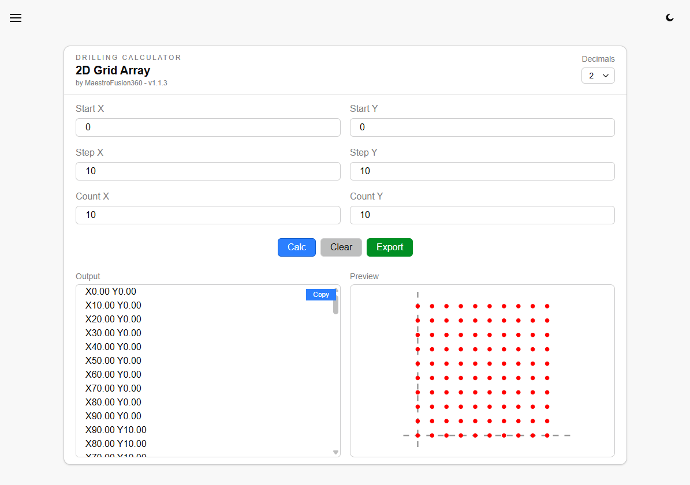
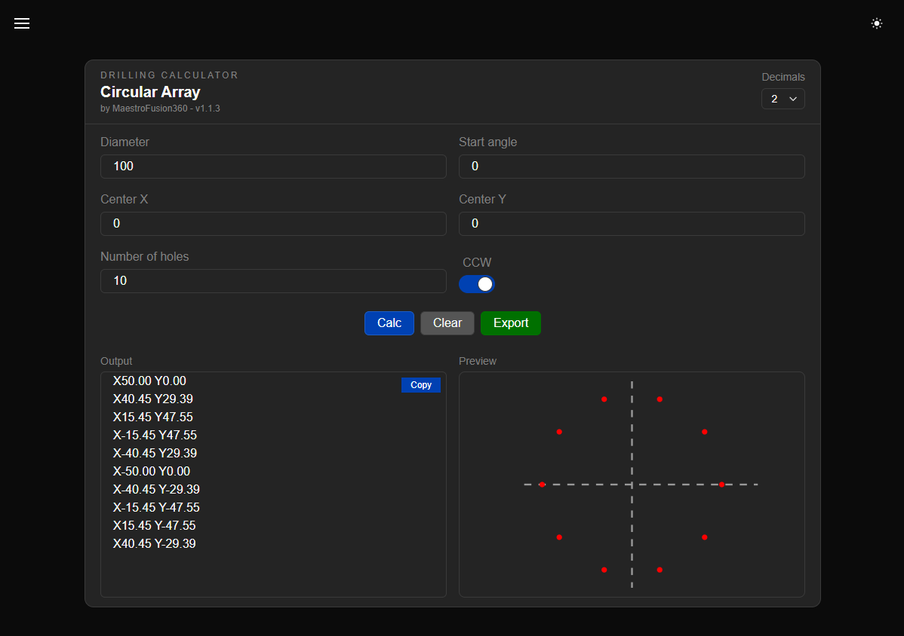

<!-- markdownlint-disable MD033 -->
<!-- markdownlint-disable MD045 -->

# Drilling Calculator

A fast and precise **G-code coordinate calculator** for circular and grid hole arrays in CNC programs.  
Designed for machinists, engineers, and Fusion 360 users.  
Now featuring export-ready **G-code cycles** for G81, G82, G83 and XY only mode.

  
Click to see the screenshots

  <h1 align="center">
    
    
  </h1>

---

## 📑 Table of Contents

- [Drilling Calculator](#drilling-calculator)
  - [📑 Table of Contents](#-table-of-contents)
  - [✨ Features](#-features)
  - [🚀 Usage](#-usage)
  - [🧾 G-code Export](#-g-code-export)
  - [🧱 Tech Stack](#-tech-stack)
  - [📄 License](#-license)
  - [📞 Contact](#-contact)

---

## ✨ Features

- 📐 Circular array calculation (with start angle & CCW/CW support)
- 📊 Grid layout with serpentine logic
- 🎯 Precision control (1–3 decimal places)
- 📤 Export to full G-code: `G81`, `G82`, `G83`, or plain `XY` mode
- 🌗 Light/Dark mode toggle
- 📱 Responsive UI
- 🖱️ Keyboard-accessible, focus-trapped modal dialogs

---

## 🚀 Usage

1. Choose mode: **Circular** or **2D Grid**
2. Fill in relevant inputs:
   - 📏 Diameter, angle, center, hole count (for Circular)
   - 🧮 Start, step, count (for Grid)
3. Press **"Calc"** to generate hole coordinates
4. Preview coordinates and positions
5. Hit **"Export"** to download a ready-to-run `.nc` program

---

## 🧾 G-code Export

Supported cycles:

| Cycle | Description                    |
| :---- | :----------------------------- |
| G81   | Drilling                       |
| G82   | Spot Drilling (with dwell `P`) |
| G83   | Peck Drilling (with `Q` step)  |
| XY    | Pure coordinate output only    |

Generated programs include full:

- Tool change (`T`, `M06`)
- Spindle setup (`S`, `M03`)
- Feed rate, safe Z, drilling depth
- Header, comments, and footer

---

## 🧱 Tech Stack

- [Svelte](https://svelte.dev) ⚡️
- [svelte-sonner](https://github.com/wobsoriano/svelte-sonner) for toasts
- TypeScript/JavaScript
- Custom G-code export logic

---

## 📄 License

This project is licensed under the **MIT License**.  
See the [LICENSE](LICENSE.md) file for details.

---

## 📞 Contact

**Email:** [maestrofusion360@gmail.com](mailto:maestrofusion360@gmail.com)  
**Telegram:** [@MaestroFusion360](https://t.me/MaestroFusion360)

---

  

